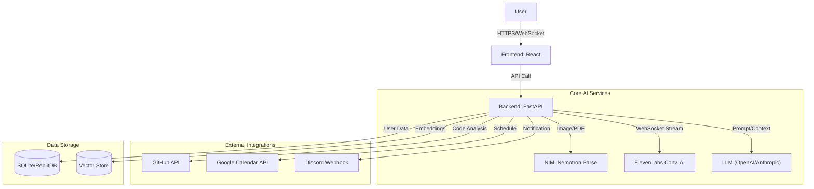

# Technical Specifications & Architecture

## 1. System Architecture

## 2. Technology Stack

- **Frontend:** React 18 (Vite 6), TypeScript, Tailwind CSS 3.4, Zustand, TanStack Query.
- **Backend:** Python 3.12, FastAPI, Uvicorn, Pydantic v2, `uv` (Package Manager).
- **Infrastructure:** Replit Core (Reserved VM), Replit Secrets.
- **Key Libraries:**
    - `elevenlabs`: Voice Streaming.
    - `httpx`: Async HTTP Client.
    - `tree-sitter`: Code AST Analysis.
    - `apscheduler`: Background Jobs.

## 3. API Specification (Core Endpoints)

| Method | Endpoint | Description | Request | Response |
| --- | --- | --- | --- | --- |
| `POST` | `/api/v1/analyze/resume` | 이력서 업로드/파싱 | `file: UploadFile` | `{ "skills": [], "experience": [] }` |
| `POST` | `/api/v1/analyze/github` | 리포지토리 분석 | `{ "repo_url": "str" }` | `{ "weaknesses": [], "code_style": "str" }` |
| `POST` | `/api/v1/roadmap/generate` | 로드맵 생성 | `{ "gap_analysis_id": "str" }` | `{ "weekly_plan": [] }` |
| `WS` | `/ws/interview/session` | 실시간 면접 (WebSocket) | `Binary Audio Stream` | `Audio Stream, Events` |

## 4. Database Schema (Draft)

- **Users:**
  - `id` (UUID, PK)
  - `name` (String)
  - `github_id` (String, Optional)
  - `calendar_token` (String, Encrypted)
  
- **Resumes:**
  - `id` (UUID, PK)
  - `user_id` (FK)
  - `raw_text` (Text)
  - `parsed_json` (JSON, Nemotron Output)
  - `masked_pii` (Boolean)

- **GapAnalysis:**
  - `id` (UUID, PK)
  - `user_id` (FK)
  - `target_job_url` (String)
  - `missing_skills` (JSON)
  - `match_score` (Integer)

- **Interviews:**
  - `id` (UUID, PK)
  - `user_id` (FK)
  - `analysis_id` (FK)
  - `recording_url` (String)
  - `feedback_summary` (Text)
  - `created_at` (DateTime)
