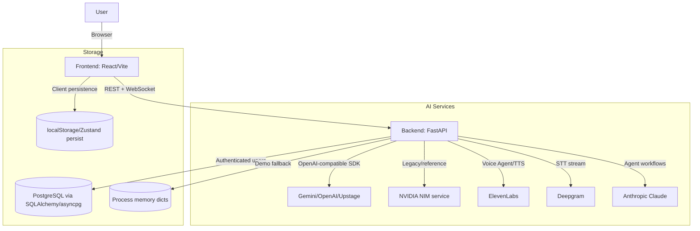

# Technical Specifications & Architecture

## 1. System Architecture


```mermaid
graph TD
    User -->|Browser| FE[Frontend: React/Vite]
    FE -->|REST + WebSocket| BE[Backend: FastAPI]

    subgraph "AI Services"
        BE -->|OpenAI-compatible SDK| LLM[Gemini/OpenAI/Upstage]
        BE -->|Legacy/reference| NVIDIA[NVIDIA NIM service]
        BE -->|Voice Agent/TTS| Eleven[ElevenLabs]
        BE -->|STT stream| Deepgram[Deepgram]
        BE -->|Agent workflows| Anthropic[Anthropic Claude]
    end

    subgraph "Storage"
        BE -->|Authenticated users| DB[(PostgreSQL via SQLAlchemy/asyncpg)]
        BE -->|Demo fallback| MEM[(Process memory dicts)]
        FE -->|Client persistence| LS[(localStorage/Zustand persist)]
    end
```

## 2. Technology Stack

- **Frontend:** React 19, Vite 7, TypeScript, Tailwind CSS 3.4, Zustand 5, TanStack Query 5.
- **Backend:** Python 3.12, FastAPI, Uvicorn, Pydantic v2, SQLAlchemy 2, asyncpg, `uv`.
- **AI/ML:** OpenAI-compatible SDK for Gemini/OpenAI/Upstage, legacy NVIDIA service retained, Anthropic-based agents, ElevenLabs, Deepgram, LangGraph.
- **Deployment target:** Replit-style `0.0.0.0:8000` backend with optional frontend static build serving.

## 3. Runtime State and Memory

### Agent/project memory
- `.agent/memory/active_context.md`: current work state and next steps.
- `.agent/memory/tech_spec.md`: architecture and implementation snapshot.
- `.agent/memory/api_schema.md`: API snapshot.
- `.agent/memory/memory_audit.md`: memory/persistence risk map.

### OMX runtime state
- `.omx/state/*.json`, `.omx/logs/*.jsonl`, `.omx/cache/codebase-map.json` are session/runtime metadata, not product data storage.

### Backend in-memory fallback
- `profiles_store`: unauthenticated profile demo state.
- `companies_store`: unauthenticated company/JD demo state.
- `active_sessions`: interview conversation sessions.
- `roadmaps_store`, `problems_store`: roadmap/problem fallback state.
- `EmbeddingService._cache`: process-local embedding cache.

Known risk: these stores are process-local, unbounded or lightly bounded, and lost on restart. Production paths should prefer DB/Redis/object storage and TTL/LRU cleanup.

### Frontend persistence
- `jobfit-profile`: resume/JD/profile/analysis state.
- `jobfit-auth` and `jobfit_access_token`: auth state/token.
- `jobfit-interview-history`: recent feedback summaries, capped at 50 entries.
- `jobfit-problems`: generated problem cache.
- `jobfit_github_config`: currently stores GitHub token and should be replaced with safer server-side/session-only handling.

## 4. Core API Surface

- `/api/v1/auth`: OAuth/JWT auth.
- `/api/v1/analyze`: resume, GitHub, JD, and gap analysis.
- `/api/v1/profile`: authenticated DB profile or demo memory fallback.
- `/api/v1/companies`: company/JD tabs and match analysis.
- `/api/v1/interview`: REST and WebSocket interview flows.
- `/api/v1/roadmap`: roadmap, generated problems, and evaluation.
- `/api/v1/git`: GitHub token validation, repo listing, and push helpers.

## 5. Security Constraints

- Mask resume/user PII before sending data to LLM or external APIs.
- Do not log raw PII, API keys, JWT secrets, OAuth tokens, or GitHub tokens.
- Keep SSRF defenses in JD scraping code.
- Do not commit `.env`, API keys, tokens, or credential files.
- Avoid long-lived browser storage for high-value tokens.

## 6. Validation Commands

```bash
uv run ruff format --check server/ tests/
uv run ruff check server/ tests/
uv run pytest
npm --prefix client run lint
npm --prefix client run build
```
